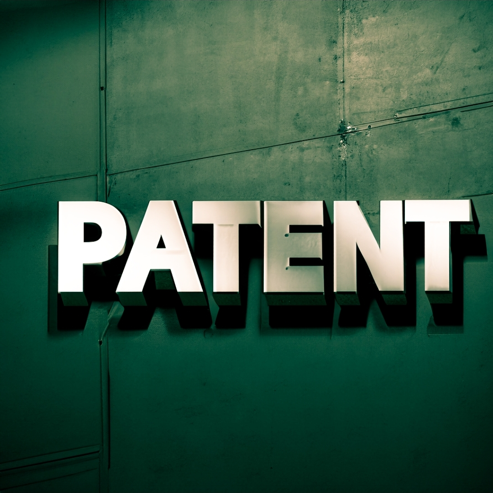

# patent-law
Patent Principles and Laws

[Live preview](https://htmlpreview.github.io/?https://github.com/rezamarzban/patent-law/blob/main/index.html)

Patent Principles:

1. `Misappropriation of intellectual property is not allowed.`
2. `Patent infringement is strictly prohibited.`
3. `Unauthorized use of patented inventions is illegal.`
4. `Ethical conduct in patent filing is required.`
5. `Unscrupulous actions will not be tolerated.`
6. `Opportunism is prohibited.`
7. `Unscrupulous behavior is unacceptable.`
8. `Taking advantage of others is not permitted.`
9. `Unscrupulous behavior is not allowed.`
10. `Opportunism is not allowed.`

Patent Laws:

1. `The unauthorized use of a patented invention constitutes patent infringement.`
2. `Intellectual property theft is subject to legal penalties.`
3. `Engaging in deceptive practices in patent applications is prohibited.`
4. `Filing false information in a patent application may result in legal consequences.`
5. `Ethical standards in the patent process are mandated by law.`
6. `Misrepresentation of invention details can lead to invalidation of the patent.`
7. `Failure to disclose relevant prior art can be considered unethical.`
8. `Intentional infringement of patent rights is a violation of federal law.`
